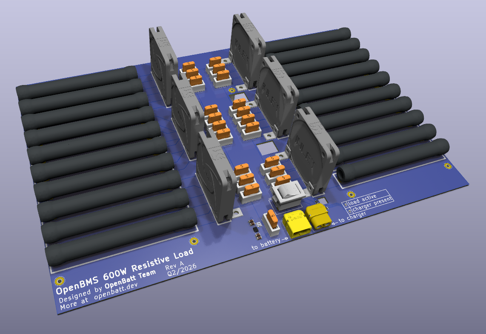
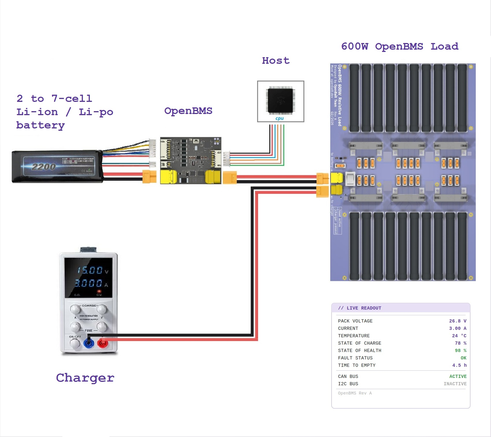
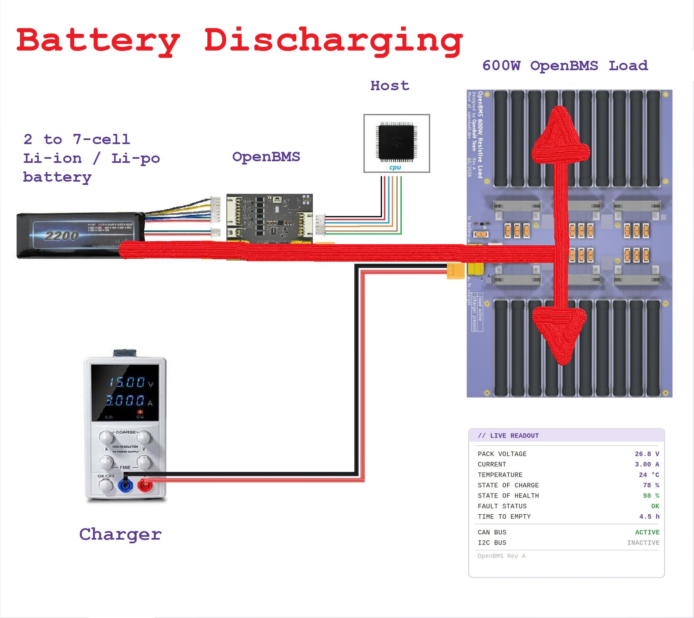
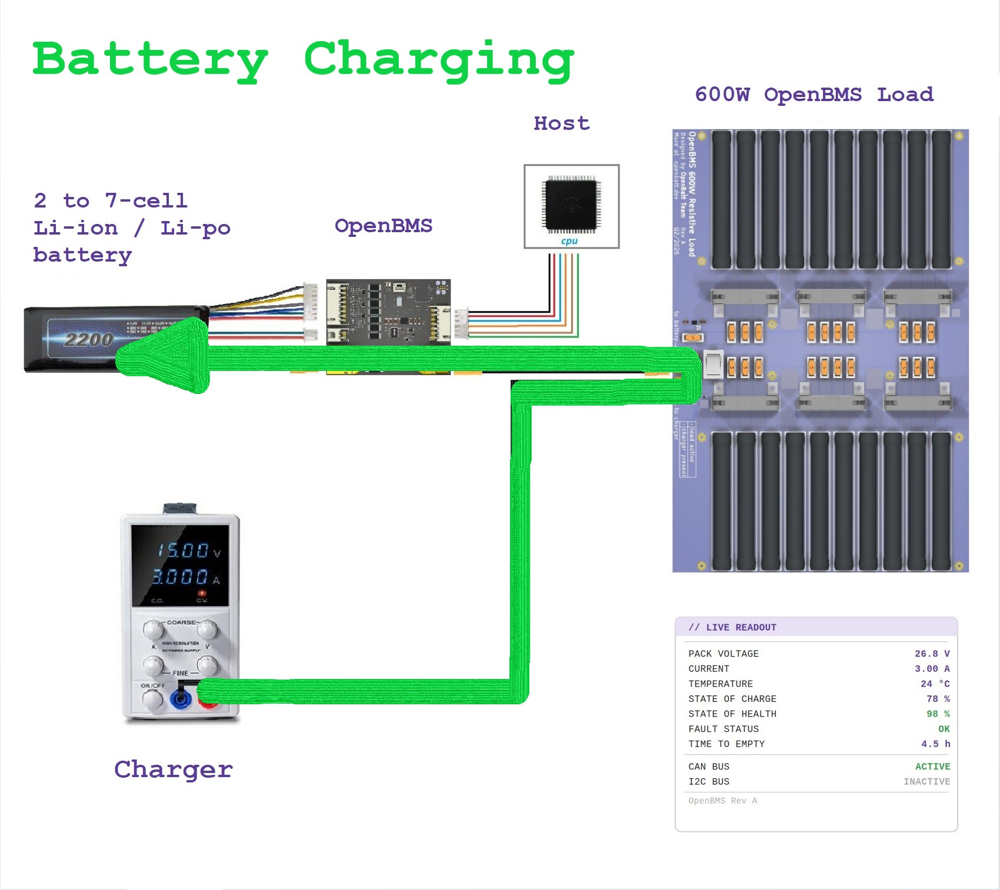
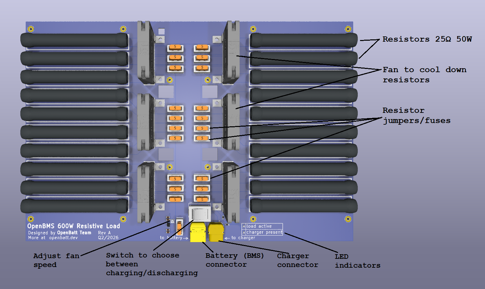

# OpenBMS Load

**OpenBMS Load** is a hardware design of a resistive load used for battery discharging. Its main purpose is for testing battery management system (BMS) during charge and discharge cycles.

## How OpenBMS Load fits into system?

Battery system consists of:
- 2 to 7-cell Li-ion/Li-po battery
- OpenBMS, more at [OpenBMS-hardware](https://github.com/open-batt/openbms-hardware)
- Host (I2C/CAN interfaces, wake-up signal)
- OpenBMS Load, 600W resistive load
- Charger

## Features

- 🔥 Twenty 25-ohm 50W resistors to dissipate up to 600W
- 🔛  Jumpers / 5A fuse - each resistor has jumper/fuse to enable it or disable it - this way total load resistance can be adjusted from 1 to 20 ohms
- 🔌 Male XT60 connector for BMS (battery) connection
- 🔌 Female XT60 connector for charger connection
- 🔄 Tri state switch:
  - 1 - Battery discharging - energy flows from battery to load (resistors)
  - 2 - Battery charging - energy flows from charger to battery (resistors are bypassed and not used)
  - 3 - Idling - battery is neither charging nor discharging
- 💨 Six fans to blow heat from resistors - speed adjustable by potentiometer
- 🟢 Green LED to indicate that charger is present
- 🔴 Red LED to indicate that battery is discharging
  
## Overview

The OpenBMS 600W Resistive Load is a purpose-built battery testing board designed to work alongside the OpenBMS system. 

It carries twenty 25Ω 50W wirewound resistors arranged across the board, capable of dissipating up to 600W of power. Each resistor is individually switchable via a jumper and protected by a 5A fuse, allowing the total load resistance to be adjusted between 1 and 20 ohms. 

Six cooling fans keep the resistors from overheating, with speed controlled by an onboard potentiometer. 

Two XT60 connectors handle battery and charger connections, and a three-position switch selects between discharging (energy flows from battery into the resistors), charging (charger feeds the battery directly, bypassing the resistors), and idle mode. 

A green LED signals charger presence and a red LED indicates active discharging.

## ❤️ Funding

This project is funded through [NGI0 Commons Fund](https://nlnet.nl/commonsfund), a fund established by [NLnet](https://nlnet.nl) with financial support from the European Commission's [Next Generation Internet](https://ngi.eu) program. 

We are very grateful to the NLnet team for helping us on our path, and we encourage you too to apply and get funds to build your project! 🚀
Learn more at the [NLnet project page](https://nlnet.nl/project/OpenBMS).

## License

OpenBMS-Load is licensed under CERN OHL-S v2 license.

Check [openbatt.dev](https://openbatt.dev) for more!
